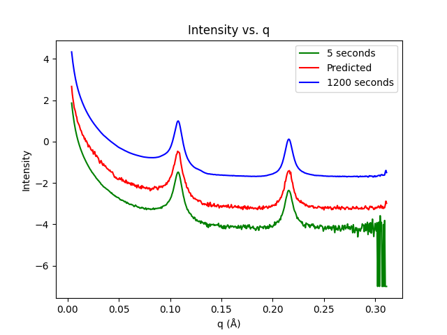

# Description
constants.py holds all constants that are necessary for running the program. It is necessary to change the constant values for the program to correctly get the files and run as intended. To ensure that everything works properly, keep the python files in the same directory as the directory with your data. This project was a proof of concept in showing that Multilayer Perceptrons can be used to make predictions on Small Angle X-Ray Scattering data. It was thanks to the help of the NSF, NMHU and UCSB that I was able to work on this project. I am no longer maintaining this project, but will respond to any inquiries about the program. I will add an example csv file to demonstrate what the data we gave the model looked like as I cannot upload the data I used originally. I always intended for this to be open-source and released to public, so here it is.

Here is a picture of what the model in First_Model_Attempt.py can currently do:
  
It is able to take a scattering profile at 5 (any) seconds and make a prediction of what it will be at 1200 (any) seconds compared to what the scattering profile actually is at 1200 seconds.

# Workflow
Before running First_Model_Attempt.py, make sure that you run Filename_Parsing.py at least once to generate the Training_Set.csv file.
Without this file, the model will error since it does not have the preprocessed data to work with.

# Modifying constants.py
constants.py is the file that contains all constants shared between multiple files. Currently only stores ```LOG``` and ```NUM_FEATS``` constants, which are shared between First_Model_Attempt.py and Filename_Parsing.py. If ```LOG``` = True, then the preprocessing will use log10 instead of dividing by qError. ```NUM_FEATS``` currently only accepts integer values of 1 or 2, if 2 is chosen than preprocessing will include the qError as a feature for the training set.

# Modifying Preprocessing
Filename_Parsing.py is the file for all things preprocessing related. This includes things like randomly collecting n number of samples.
To adjust any of the preprocessing, interact with the constants at the top of Filename_Parsing.py. To change the number of random files collected, modify ```NUM_FILES``` with a positive integer. ```NUM_FILES``` is the amount of files the program will collect from each sample, so if ```NUM_FILES = 100``` and 5 samples, then the result will be 500 files. Samples are automatically detected by the program from the Data directory, so only the amount of files frome each sample is necessary.

# Necessary Packages:
- Pandas-version: pandas-2.2.2
- Numpy-version: numpy-1.26.4
- Keras-version: keras-3.4.1
- Tensorflow-version: 2.17.0
- Tensorflow_Probability-version: 0.24.0
- Scipy-version: 1.14.0
- Matplotlib-version: 3.9.0
- Along with all the dependencies for the above packages.

